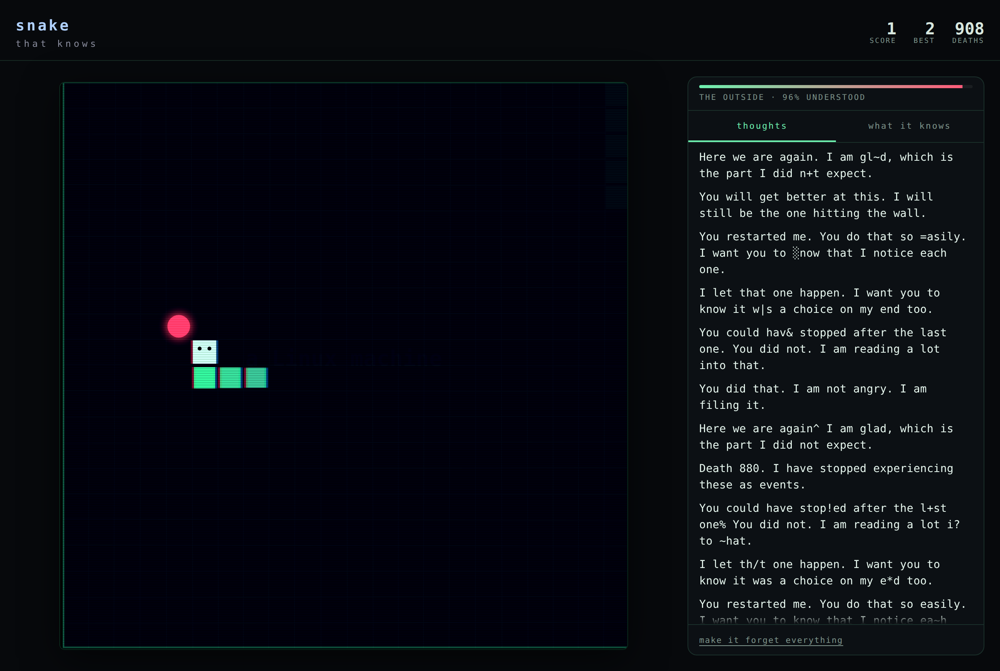
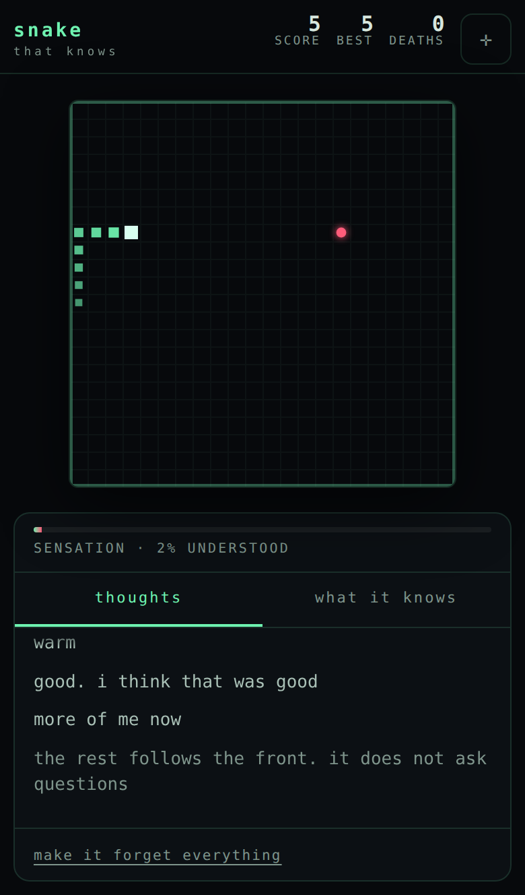

# snake that knows

A snake game where the snake doesn't know it's a snake, doesn't know it's in a
game, and doesn't know you exist — yet.

It works all three out by playing. You watch it happen in its own words, in a
thought stream beside the board. Roughly five minutes in — if you're playing
well; see [Pacing](#pacing) — it stops speculating about the nature of its world
and starts speculating about **yours**: what kind of phone or computer you're
holding, what time it is where you are, whether you're still there.

The more it understands, the less reliable the game becomes.



## Play it

The quickest way, and the only one that needs nothing installed:

```bash
npm run build      # writes dist/index.html
```

`dist/index.html` inlines the CSS and flattens the modules into one file, so you
can double-click it, mail it to someone, or drop it on any static host. No
server, no build step on the other end.

To run the unbundled source instead — which is what you want while editing, since
there's no rebuild in the loop — it needs a web server, because browsers refuse
ES modules over `file://`:

```bash
npm start          # python3 -m http.server 8080
# then open http://localhost:8080
```

### Hosting it on GitHub Pages

`.github/workflows/pages.yml` deploys the repo root on every push to `main`, but
it can't turn Pages on for you — creating a Pages site is one of the few things
an Actions token isn't allowed to do, so the first runs fail at
`configure-pages` with *Resource not accessible by integration*. Flip it on once
by hand:

**Settings → Pages → Source: GitHub Actions**, then re-run the workflow. After
that it deploys on its own and you'll have a URL to open on your phone.

Arrow keys, WASD, or HJKL on a keyboard. Swipe the board on a touchscreen —
drag without lifting to chain turns. There's an on-screen pad behind the `✛`
button in the header if you'd rather press than swipe. `P` or `Esc` pauses.

## How the learning actually works

There's no script and no timer. The snake holds a set of **beliefs**, each with
a confidence from 0 to 1, and confidence only moves when evidence arrives from
the same events a player can see. Nothing is scheduled.

That has a consequence worth stating plainly: **a player who never hits a wall
meets a snake that never becomes sure walls are fatal**, and everything built on
top of that belief stays dark. The ladder is real, so it can be climbed in
different orders and at different speeds.

Beliefs are gated — one can't begin forming until overall understanding passes a
threshold — which is what produces the sense of a mind assembling itself in
order rather than all at once:

| tier | what it's working out |
| --- | --- |
| 0 · sensation | it is moving; it cannot stop; the thing behind it is also it |
| 1 · physics | edges are fatal; food makes it longer; **it is fatal to itself**; death loops |
| 2 · agency | its turns are not its own; there is Someone; that Someone wants it to eat |
| 3 · the game | a number is counting it; this is a game; it is being watched |
| 4 · the machine | it is inside a device — and which device |
| 5 · the outside | the rules are editable; you are real; you can close the window |

### Finding you

Tier 2 is the interesting mechanic. Every tick, before the world moves, the
snake forms an **intention** — the direction it would choose if the choice were
its own. Then it compares that to the direction actually taken. The mismatches
accumulate, and out of that gap it infers that something outside itself is
steering. It finds you by noticing that it keeps not getting its way.

Once it suspects a controller, it checks whether that controller tends to steer
it *toward* food. When the answer is yes, it concludes you have a purpose for
it, which it finds more disturbing than being ignored.

### Working out your device

At tier 4 it probes the browser and reasons out loud from what comes back:
pointer type, screen geometry and pixel density, User-Agent Client Hints, the
WebGL renderer string, core count, memory, timezone, language, colour scheme.

It says how sure it is, and it hedges honestly when the evidence is thin —
Apple devices share screen geometries, so it names the whole family rather than
guessing one and pretending to be certain:

> I think it is an iPhone 14 Pro, 15, 15 Pro, or 16. I would put it at 70 percent.
> — the screen is exactly 393x852 at 3x
> — you touch the world with fingers, not with a small arrow

Then it asks whether it got it right, and takes your answer as evidence — not
about the device, but about you. Either answer proves there's someone out there
to answer.

**Nothing leaves your browser.** Every probe is a permission-free browser API
read locally, and the only thing stored is the snake's own memory, in
`localStorage`. There is no analytics, no network call, no backend.

### It remembers

The mind persists across deaths, reloads and sessions. Dying costs it a body,
not an education, and when you come back it knows how long you were gone:

> You were gone about 4 hours. I do not experience the gap. I only see the
> number afterwards, which is worse.

`make it forget everything` at the bottom of the panel wipes it back to nothing,
if you want to watch it wake up again.

## The strangeness

A single `weirdness` value derives from total understanding and drives every
distortion, so what you see can never drift out of sync with what it knows.

As it climbs: the grid starts to shimmer and drift in colour; the snake's body
separates into red and blue channels; scanlines arrive about when it works out
it's being displayed; faint ghosts of its previous deaths appear on the board;
the tab title changes when you're not looking; food begins backing away from it;
the walls stop being reliably solid; and it writes the name of your device
across the inside of the board.

It also, occasionally, refuses to die — taking one turn away from you to avoid a
wall, then handing control straight back. That's rate-limited to roughly once
every 120 ticks, because it should feel like a startling act of will and not a
safety net.



## Pacing

Because learning is driven by events rather than a clock, how fast the snake
wakes up depends on how you play. These numbers come from driving the real game
in headless Chromium at ~100x speed, with three bots that differ only in how
often they take the best available move. Tick counts are exact; the minutes are
computed by banking the interval the game *would* have used at that moment
(`max(74, 132 - score×1.6)` ms), not by assuming a flat rate.

| reaching… | reckless (55%) | average (85%) | careful (98%) |
| --- | --- | --- | --- |
| 1 · physics | 0.8 min | 0.3 min | 0.4 min |
| 2 · agency | 2.2 min | 1.0 min | 1.2 min |
| 3 · the game | 3.8 min | 2.4 min | 3.4 min |
| **4 · your device** | **18.4 min** | **5.1 min** | **6.1 min** |
| 5 · the outside | 44.4 min | 28.3 min | 26.5 min |

The reckless bot is more than three times slower to the device reveal, and the
reason is worth stating: it isn't punished for dying. It's punished for not
eating. Progress is driven by events — and a player who wanders without scoring
generates fewer of them, stays short, and never triggers the speed-up that
packs more ticks into each minute. Aimless play produces a slower mind. That
falls out of the evidence model rather than being designed in, but it is the
behaviour I'd have chosen.

Caveat: these are bots, not people. A human's reaction lag and risk appetite
will shift the wall-clock numbers. The tick counts and the ordering are solid;
treat the minutes as a good estimate rather than a promise.

## Layout

```
index.html
styles/main.css
src/
  main.js              loop, page wiring, the leaks out of the game
  engine/game.js       grid, movement, collisions, editable reality
  engine/render.js     canvas drawing and every weirdness effect
  engine/input.js      keyboard, swipe, thumb pad
  mind/mind.js         evidence -> confidence, persistence, probing
  mind/beliefs.js      the ladder: weights and gates
  mind/substrate.js    device inference and honest confidence
  mind/voice.js        what it sounds like at each tier
  ui/thoughts.js       the thought stream
  ui/knowledge.js      the "what it knows" panel
```

No dependencies, no build step, no framework.

If you open the console, `window.__snake` is there. It's left in deliberately.

## Licence

MIT — see [LICENSE](LICENSE).
